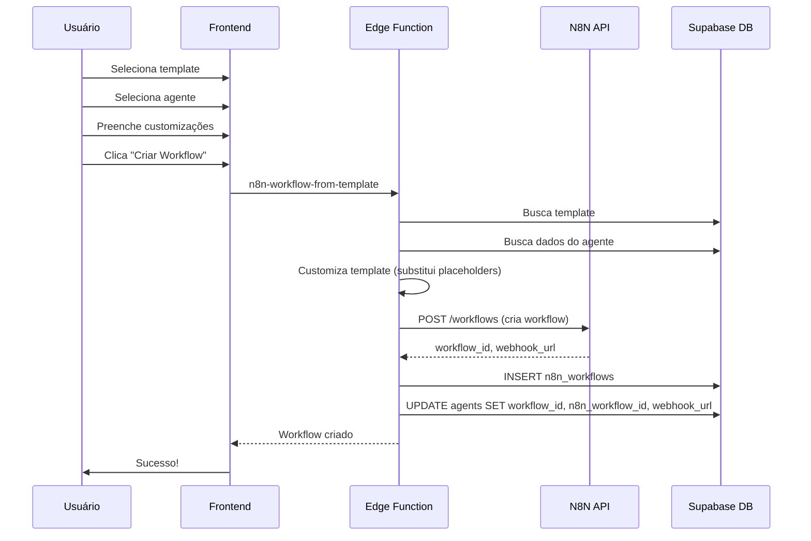
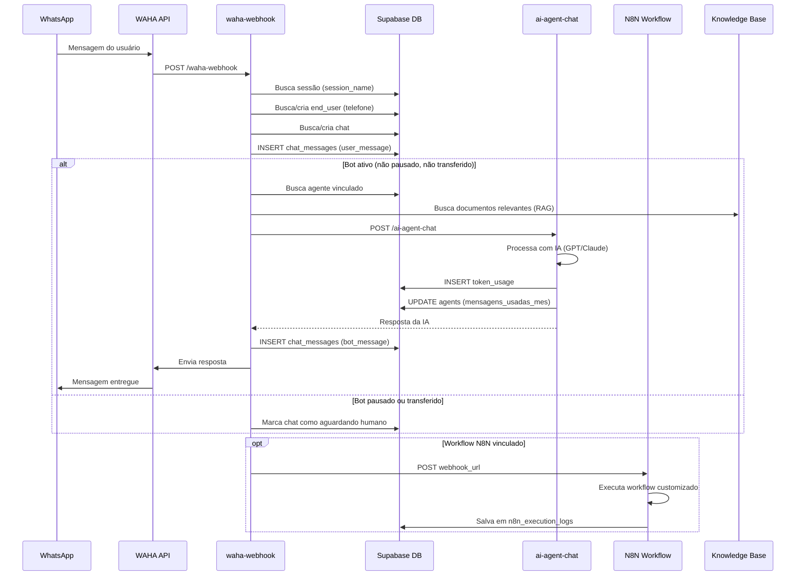
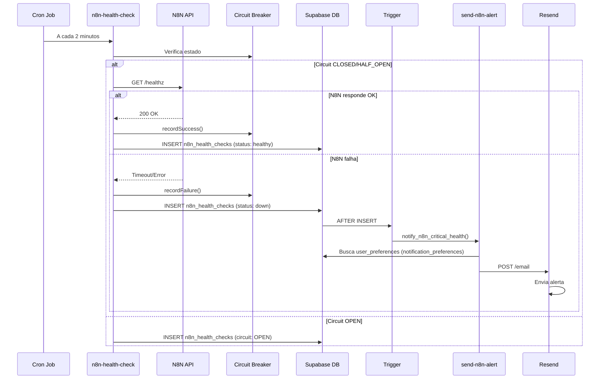
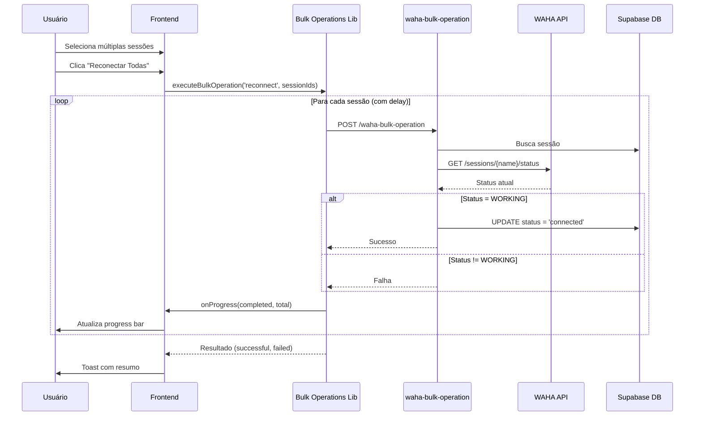
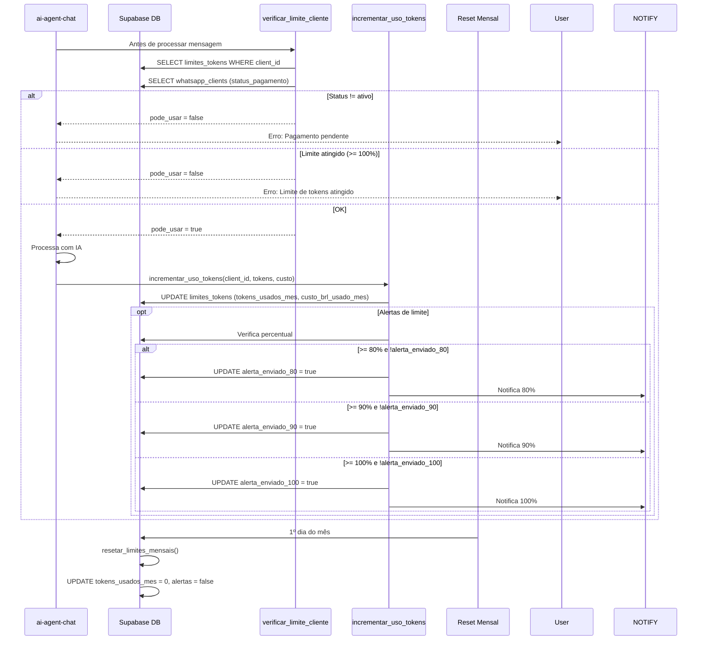
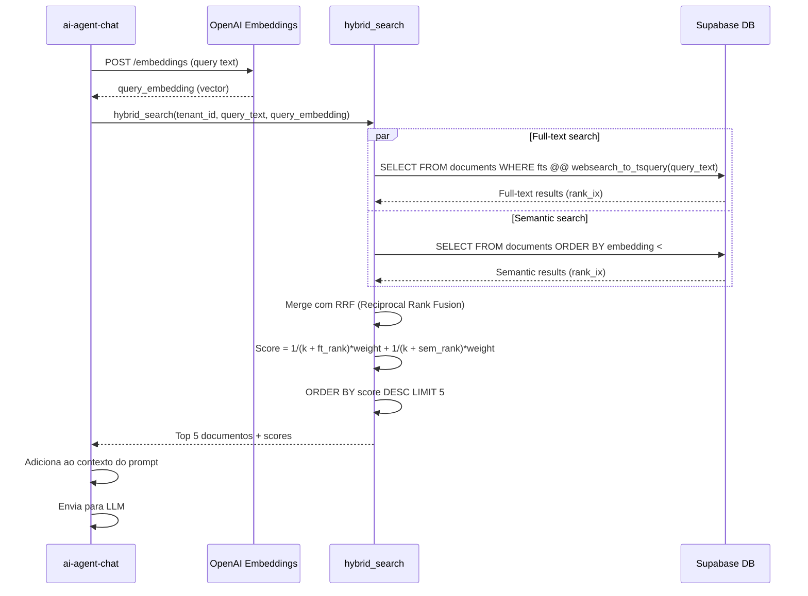

# 📚 DOCUMENTAÇÃO COMPLETA DO PROJETO - SISTEMA DE ATENDIMENTO IA

## 📋 ÍNDICE

1. [Visão Geral](#visao-geral)
2. [Arquitetura](#arquitetura)
3. [Páginas (Frontend)](#paginas-frontend)
4. [Edge Functions (Backend)](#edge-functions-backend)
5. [Banco de Dados](#banco-de-dados)
6. [Componentes Principais](#componentes-principais)
7. [Hooks Customizados](#hooks-customizados)
8. [Integrações](#integracoes)
9. [Tipos e Interfaces](#tipos-e-interfaces)
10. [Fluxos de Trabalho](#fluxos-de-trabalho)

---

## 🎯 VISÃO GERAL

### Descrição do Projeto
Sistema completo de atendimento automatizado via WhatsApp com Inteligência Artificial, integração com N8N para workflows, monitoramento de saúde, gestão de clientes, agentes e análise de custos.

### Tecnologias Principais
- **Frontend**: React 18.3.1, TypeScript, Vite
- **UI**: Radix UI, Tailwind CSS, shadcn/ui
- **Backend**: Supabase (PostgreSQL, Edge Functions, Realtime)
- **IA**: OpenAI (GPT-4o, GPT-4 Turbo), Anthropic (Claude)
- **Automação**: N8N (Workflows)
- **WhatsApp**: WAHA (WhatsApp HTTP API)
- **Notificações**: Resend (Email)

---

## 🏗️ ARQUITETURA

### Estrutura de Diretórios
```
project/
├── src/
│   ├── pages/              # Páginas React
│   ├── components/         # Componentes reutilizáveis
│   ├── hooks/             # Hooks customizados
│   ├── lib/               # Bibliotecas e utilitários
│   ├── types/             # Definições TypeScript
│   └── integrations/      # Integrações (Supabase)
├── supabase/
│   ├── functions/         # Edge Functions (Deno)
│   ├── migrations/        # Migrações SQL
│   └── config.toml        # Configuração Supabase
└── public/                # Assets estáticos
```

### Padrões Arquiteturais
- **Multi-tenancy**: Isolamento por `tenant_id`
- **RBAC**: Controle de acesso baseado em roles (OWNER, ADMIN, ANALYST, SUPPORT)
- **RLS**: Row Level Security em todas as tabelas
- **Circuit Breaker**: Proteção contra falhas em cascata
- **Retry Pattern**: Tentativas automáticas com backoff exponencial
- **Real-time**: Supabase Realtime para atualizações instantâneas

---

## 📄 PÁGINAS (FRONTEND)

### 1. **Dashboard** (`/dashboard`)
- **Arquivo**: `src/pages/Dashboard.tsx`
- **Propósito**: Visão geral do sistema
- **Funcionalidades**:
  - Total de conversas, mensagens e tokens
  - Custo mensal estimado
  - Modelo de IA ativo
  - Informações do tenant e role do usuário

### 2. **Login/Register** (`/login`, `/register`)
- **Arquivos**: `src/pages/Login.tsx`, `src/pages/Register.tsx`
- **Propósito**: Autenticação de usuários
- **Funcionalidades**:
  - Login com email/senha
  - Registro de novos usuários
  - Recuperação de senha
  - Criação automática de profile

### 3. **Clients** (`/clients`)
- **Arquivo**: `src/pages/Clients.tsx`
- **Propósito**: Gestão de clientes WhatsApp
- **Funcionalidades**:
  - CRUD de clientes (`whatsapp_clients`)
  - Vinculação com planos
  - Status de pagamento
  - Informações de contato

### 4. **Agents** (`/agents`)
- **Arquivo**: `src/pages/Agents.tsx`
- **Propósito**: Gestão de agentes de IA
- **Funcionalidades**:
  - CRUD de agentes
  - Configuração de modelo, temperatura, tokens
  - Script de atendimento personalizado
  - Saudação inicial
  - Limites de mensagens
  - Vinculação com workflows N8N
  - Ativação/desativação

### 5. **Knowledge Base** (`/knowledge-base`)
- **Arquivo**: `src/pages/KnowledgeBase.tsx`
- **Propósito**: Base de conhecimento para agentes
- **Funcionalidades**:
  - Upload de documentos
  - Embeddings vetoriais
  - Busca híbrida (texto + semântica)
  - Gerenciamento de documentos por agente

### 6. **Chats** (`/chats`)
- **Arquivo**: `src/pages/Chats.tsx`
- **Propósito**: Lista de conversas
- **Funcionalidades**:
  - Visualização de todos os chats
  - Filtro por status, tags
  - Busca por nome/telefone
  - Transferência para humano
  - Pausar/retomar bot
  - Tags personalizadas
  - Exportação de histórico

### 7. **Chat Detail** (`/chats/:chatId`)
- **Arquivo**: `src/pages/ChatDetail.tsx`
- **Propósito**: Detalhes de uma conversa específica
- **Funcionalidades**:
  - Histórico completo de mensagens
  - Envio de mensagens manuais
  - Respostas rápidas
  - Transferência de atendimento
  - Tags do chat
  - Informações do end_user

### 8. **Integrations** (`/integrations`)
- **Arquivo**: `src/pages/Integrations.tsx`
- **Propósito**: Gerenciamento de workflows N8N
- **Funcionalidades**:
  - Listagem de workflows
  - Criação a partir de templates
  - Ativação/desativação
  - Testes de webhook
  - Estatísticas de execução
  - Carregamento de templates (Carros, Atendimento Humanizado)
  - Link para N8N Editor
  - Health status do N8N

### 9. **WhatsApp Dashboard** (`/whatsapp-dashboard`)
- **Arquivo**: `src/pages/WhatsAppDashboard.tsx`
- **Propósito**: Gerenciamento de sessões WhatsApp
- **Funcionalidades**:
  - Listagem de sessões WAHA
  - QR Code para conexão
  - Status de cada sessão (conectado, desconectado, aguardando QR)
  - Reconexão automática
  - Desconexão manual
  - Operações em massa (bulk operations)
  - Recovery Wizard para sessões com problemas
  - Métricas de edge functions
  - Circuit breakers status
  - Logs de atividade
  - Estatísticas por sessão

### 10. **WhatsApp Connection** (`/whatsapp-connection`)
- **Arquivo**: `src/pages/WhatsAppConnection.tsx`
- **Propósito**: Conexão inicial do WhatsApp
- **Funcionalidades**:
  - Criação de novas sessões
  - Exibição de QR Code
  - Vinculação com cliente/agente

### 11. **N8N Monitoring** (`/n8n-monitoring`)
- **Arquivo**: `src/pages/N8NMonitoring.tsx`
- **Propósito**: Monitoramento completo do N8N
- **Funcionalidades**:
  - Health checks em tempo real
  - Logs de execução
  - Cron jobs monitoring
  - Alertas configuráveis
  - Estatísticas de performance
  - Circuit breaker status

### 12. **Settings** (`/settings`)
- **Arquivo**: `src/pages/Settings.tsx`
- **Propósito**: Configurações do sistema
- **Funcionalidades**:
  - Configuração de IA (modelo, temperatura, prompt)
  - Billing (franquia, valor por token, impostos)
  - Templates N8N (carregamento de templates)
  - Notificações N8N (para super admins)
  - Preferências do usuário

### 13. **Reports** (`/reports`)
- **Arquivo**: `src/pages/Reports.tsx`
- **Propósito**: Relatórios de custos e execuções
- **Funcionalidades**:
  - Relatórios de custos por período
  - Relatórios de execuções
  - Análise de tokens utilizados
  - Exportação de dados

### 14. **Client Reports** (`/client-reports`)
- **Arquivo**: `src/pages/ClientReports.tsx`
- **Propósito**: Relatórios específicos por cliente
- **Funcionalidades**:
  - Custo por cliente
  - Tokens utilizados
  - Conversas realizadas

### 15. **Token Usage** (`/token-usage`)
- **Arquivo**: `src/pages/TokenUsage.tsx`
- **Propósito**: Análise detalhada de uso de tokens
- **Funcionalidades**:
  - Dashboard de consumo
  - Gráficos de uso
  - Breakdown por agente
  - Custos em USD e BRL
  - Cache hits

### 16. **Planos** (`/planos`)
- **Arquivo**: `src/pages/Planos.tsx`
- **Propósito**: Gestão de planos de serviço
- **Funcionalidades**:
  - CRUD de planos
  - Limites por plano
  - Recursos inclusos
  - Integrações permitidas

### 17. **Users** (`/users`)
- **Arquivo**: `src/pages/Users.tsx`
- **Propósito**: Gestão de usuários do tenant
- **Funcionalidades**:
  - Convites de usuários
  - Alteração de roles
  - Ativação/desativação

### 18. **Master Admin** (`/master-admin`)
- **Arquivo**: `src/pages/MasterAdmin.tsx`
- **Propósito**: Administração global (super admins)
- **Funcionalidades**:
  - Gestão de todos os tenants
  - Criação de super admins
  - Métricas globais

### 19. **Test Agent Chat** (`/test-agent-chat`)
- **Arquivo**: `src/pages/TestAgentChat.tsx`
- **Propósito**: Testar agentes de IA
- **Funcionalidades**:
  - Simulação de conversas
  - Testes de scripts
  - Debug de respostas

### 20. **WhatsApp Test** (`/whatsapp-test`)
- **Arquivo**: `src/pages/WhatsAppTest.tsx`
- **Propósito**: Testes de integração WhatsApp
- **Funcionalidades**:
  - Envio de mensagens de teste
  - Verificação de webhooks

### 21. **Chat Analytics** (`/chat-analytics`)
- **Arquivo**: `src/pages/ChatAnalytics.tsx`
- **Propósito**: Análises avançadas de conversas
- **Funcionalidades**:
  - Métricas de atendimento
  - Tempo médio de resposta
  - Taxa de resolução
  - Satisfação do cliente

---

## ⚡ EDGE FUNCTIONS (BACKEND)

### Categoria: AI & Chat

#### 1. **ai-agent-chat**
- **Arquivo**: `supabase/functions/ai-agent-chat/index.ts`
- **Propósito**: Processamento de conversas com IA via agentes
- **Método**: POST
- **Body**:
  ```json
  {
    "agentId": "uuid",
    "chatId": "bigint",
    "message": "string",
    "userId": "uuid"
  }
  ```
- **Retorna**: Resposta da IA, tokens utilizados, custo

#### 2. **ai-chat**
- **Arquivo**: `supabase/functions/ai-chat/index.ts`
- **Propósito**: Chat genérico com IA (sem agente específico)
- **Método**: POST
- **Body**: Similar ao ai-agent-chat

#### 3. **search-knowledge**
- **Arquivo**: `supabase/functions/search-knowledge/index.ts`
- **Propósito**: Busca híbrida (vetorial + texto) na base de conhecimento
- **Método**: POST
- **Body**:
  ```json
  {
    "query": "string",
    "agentId": "uuid",
    "limit": 5
  }
  ```
- **Retorna**: Documentos relevantes com scores

### Categoria: WhatsApp (WAHA)

#### 4. **waha-session-create**
- **Arquivo**: `supabase/functions/waha-session-create/index.ts`
- **Propósito**: Criar nova sessão WhatsApp
- **Método**: POST
- **Body**:
  ```json
  {
    "sessionName": "string",
    "clientId": "uuid",
    "agentId": "uuid",
    "webhookUrl": "string"
  }
  ```
- **Retorna**: QR Code, sessão criada

#### 5. **waha-session-qr**
- **Arquivo**: `supabase/functions/waha-session-qr/index.ts`
- **Propósito**: Obter QR Code de sessão existente
- **Método**: POST
- **Body**: `{ "sessionName": "string" }`
- **Retorna**: QR Code base64, expiração

#### 6. **waha-session-status**
- **Arquivo**: `supabase/functions/waha-session-status/index.ts`
- **Propósito**: Verificar status de sessão
- **Método**: POST
- **Body**: `{ "sessionName": "string" }`
- **Retorna**: Status (WORKING, SCAN_QR_CODE, FAILED)

#### 7. **waha-session-stop**
- **Arquivo**: `supabase/functions/waha-session-stop/index.ts`
- **Propósito**: Desconectar sessão WhatsApp
- **Método**: POST
- **Body**: `{ "sessionName": "string" }`

#### 8. **waha-sync-sessions**
- **Arquivo**: `supabase/functions/waha-sync-sessions/index.ts`
- **Propósito**: Sincronizar todas as sessões com WAHA
- **Método**: POST
- **Retorna**: Sessões atualizadas, erros

#### 9. **waha-send-message**
- **Arquivo**: `supabase/functions/waha-send-message/index.ts`
- **Propósito**: Enviar mensagem via WhatsApp
- **Método**: POST
- **Body**:
  ```json
  {
    "sessionName": "string",
    "chatId": "string",
    "text": "string"
  }
  ```

#### 10. **waha-webhook**
- **Arquivo**: `supabase/functions/waha-webhook/index.ts`
- **Propósito**: Receber webhooks do WAHA (mensagens, eventos)
- **Método**: POST
- **Body**: Payload do WAHA
- **Ações**:
  - Salvar mensagem no banco
  - Processar com IA se bot ativo
  - Responder automaticamente

#### 11. **waha-health-check**
- **Arquivo**: `supabase/functions/waha-health-check/index.ts`
- **Propósito**: Verificar saúde da API WAHA
- **Método**: GET
- **Retorna**: Status, latência

#### 12. **waha-health-monitor**
- **Arquivo**: `supabase/functions/waha-health-monitor/index.ts`
- **Propósito**: Monitoramento periódico de sessões
- **Método**: POST (chamado por cron)
- **Ações**:
  - Verificar todas as sessões
  - Detectar desconexões
  - Salvar health checks

#### 13. **waha-bulk-operation**
- **Arquivo**: `supabase/functions/waha-bulk-operation/index.ts`
- **Propósito**: Operações em massa (reconectar, desconectar, atualizar QR)
- **Método**: POST
- **Body**:
  ```json
  {
    "operation": "reconnect|disconnect|refresh_qr",
    "sessionIds": ["uuid[]"]
  }
  ```

### Categoria: N8N

#### 14. **n8n-workflow-create**
- **Arquivo**: `supabase/functions/n8n-workflow-create/index.ts`
- **Propósito**: Criar workflow no N8N
- **Método**: POST
- **Body**:
  ```json
  {
    "name": "string",
    "nodes": [],
    "connections": {}
  }
  ```

#### 15. **n8n-workflow-from-template**
- **Arquivo**: `supabase/functions/n8n-workflow-from-template/index.ts`
- **Propósito**: Criar workflow a partir de template
- **Método**: POST
- **Body**:
  ```json
  {
    "templateId": "uuid",
    "agentId": "uuid",
    "clientId": "uuid",
    "nome": "string",
    "customizations": {}
  }
  ```
- **Ações**:
  - Carregar template do banco
  - Customizar nodes com dados do agente
  - Criar workflow no N8N
  - Salvar em `n8n_workflows`
  - **Atualizar agents.workflow_id** (vinculação)

#### 16. **n8n-workflow-activate**
- **Arquivo**: `supabase/functions/n8n-workflow-activate/index.ts`
- **Propósito**: Ativar/desativar workflow
- **Método**: POST
- **Body**: `{ "workflowId": "string", "active": boolean }`
- **Nota**: Usa PUT (não PATCH) para N8N

#### 17. **n8n-workflow-delete**
- **Arquivo**: `supabase/functions/n8n-workflow-delete/index.ts`
- **Propósito**: Deletar workflow do N8N
- **Método**: POST
- **Body**: `{ "workflowId": "string" }`

#### 18. **n8n-health-check**
- **Arquivo**: `supabase/functions/n8n-health-check/index.ts`
- **Propósito**: Verificar saúde do N8N
- **Método**: POST
- **Retorna**: Status, latência, circuit breaker state

#### 19. **n8n-get-stats**
- **Arquivo**: `supabase/functions/n8n-get-stats/index.ts`
- **Propósito**: Estatísticas de execuções N8N
- **Método**: POST
- **Body**: `{ "timeRange": "24h|7d|30d" }`
- **Retorna**: Total executions, success rate, errors

#### 20. **n8n-webhook-callback**
- **Arquivo**: `supabase/functions/n8n-webhook-callback/index.ts`
- **Propósito**: Receber callbacks de workflows N8N
- **Método**: POST
- **Ações**:
  - Registrar execução
  - Atualizar stats
  - Notificar em caso de erro

#### 21. **n8n-circuit-status**
- **Arquivo**: `supabase/functions/n8n-circuit-status/index.ts`
- **Propósito**: Status do circuit breaker
- **Método**: GET
- **Retorna**: Estado atual (OPEN, CLOSED, HALF_OPEN)

#### 22. **send-n8n-alert**
- **Arquivo**: `supabase/functions/send-n8n-alert/index.ts`
- **Propósito**: Enviar alertas de falhas do N8N
- **Método**: POST (chamado por trigger)
- **Integrações**: Resend (email)

### Categoria: Templates

#### 23. **load-carros-template**
- **Arquivo**: `supabase/functions/load-carros-template/index.ts`
- **Propósito**: Carregar template "Vendas de Carros" no banco
- **Método**: POST
- **Body**: `{ "templateJson": {} }`

#### 24. **load-atendimento-humanizado-template**
- **Arquivo**: `supabase/functions/load-atendimento-humanizado-template/index.ts`
- **Propósito**: Carregar template "Atendimento Humanizado" no banco
- **Método**: POST
- **Body**: `{ "templateJson": {} }`

---

## 🗄️ BANCO DE DADOS

### Tabelas Principais

#### 1. **tenants**
- **Propósito**: Organizações/empresas
- **Colunas**:
  - `id` (bigint, PK)
  - `nome` (text, NOT NULL)
  - `email` (text)
  - `status` (text, default: 'ativo')
  - `documento` (text)
  - `meta` (jsonb)
  - `created_at`, `updated_at`
- **RLS**: Super admins only

#### 2. **profiles**
- **Propósito**: Perfis de usuários
- **Colunas**:
  - `id` (uuid, PK, FK -> auth.users)
  - `email` (text)
  - `full_name` (text)
  - `avatar_url` (text)
  - `created_at`, `updated_at`
- **RLS**: Próprio usuário

#### 3. **tenant_users**
- **Propósito**: Relação usuário-tenant
- **Colunas**:
  - `id` (uuid, PK)
  - `user_id` (uuid, FK -> profiles)
  - `tenant_id` (bigint, FK -> tenants)
  - `role` (app_role: OWNER, ADMIN, ANALYST, SUPPORT)
  - `is_active` (boolean)
  - `invited_by` (uuid)
  - `joined_at`, `invited_at`
- **RLS**: Membros do tenant podem ver, OWNER/ADMIN podem gerenciar

#### 4. **super_admins**
- **Propósito**: Administradores globais
- **Colunas**:
  - `id` (uuid, PK)
  - `user_id` (uuid, FK -> profiles)
  - `is_active` (boolean)
  - `created_by` (uuid)
  - `created_at`
- **RLS**: Super admins only

#### 5. **whatsapp_clients**
- **Propósito**: Clientes WhatsApp
- **Colunas**:
  - `id` (uuid, PK)
  - `tenant_id` (bigint, FK -> tenants)
  - `nome_empresa` (text)
  - `telefone` (text)
  - `email` (text)
  - `status_pagamento` (text)
  - `plano_id` (uuid, FK -> planos)
  - `created_at`, `updated_at`
- **RLS**: Por tenant

#### 6. **agents**
- **Propósito**: Agentes de IA
- **Colunas**:
  - `id` (uuid, PK)
  - `tenant_id` (bigint, FK -> tenants)
  - `client_id` (uuid, FK -> whatsapp_clients)
  - `nome_agente` (text)
  - `script_atendimento` (text)
  - `saudacao_inicial` (text)
  - `modelo_ia` (varchar: gpt-4o-mini, claude-sonnet-4, etc.)
  - `temperatura` (numeric, default: 0.7)
  - `max_tokens` (integer, default: 800)
  - `prompt_sistema` (text)
  - `workflow_id` (text) - **ID do workflow no N8N**
  - `n8n_workflow_id` (varchar) - **ID do registro em n8n_workflows**
  - `webhook_url` (text)
  - `ativo` (boolean)
  - `limite_mensagens_mes` (integer)
  - `mensagens_usadas_mes` (integer)
  - `tempo_atendimento` (integer, minutos)
  - `created_at`, `updated_at`
- **RLS**: Por tenant, OWNER/ADMIN podem gerenciar

#### 7. **waha_sessions**
- **Propósito**: Sessões WhatsApp (WAHA)
- **Colunas**:
  - `id` (uuid, PK)
  - `tenant_id` (bigint, FK -> tenants)
  - `client_id` (uuid, FK -> whatsapp_clients)
  - `agent_id` (uuid, FK -> agents)
  - `session_name` (varchar, unique)
  - `status` (varchar: connected, disconnected, WORKING, SCAN_QR_CODE)
  - `phone_number` (varchar)
  - `qr_code` (text)
  - `qr_expires_at` (timestamptz)
  - `webhook_url` (text)
  - `connected_at`, `disconnected_at`
  - `last_activity`, `last_message_at`
  - `total_messages_sent`, `total_messages_received`
  - `reconnect_attempts` (integer)
  - `created_at`, `updated_at`
- **RLS**: Por tenant

#### 8. **end_users**
- **Propósito**: Usuários finais (clientes dos chats)
- **Colunas**:
  - `id` (bigint, PK)
  - `tenant_id` (bigint, FK -> tenants)
  - `nome` (text)
  - `telefone` (text, NOT NULL)
  - `email` (text)
  - `tags` (text[])
  - `atendimento_ia` (text)
  - `setor` (text)
  - `resumo_lead` (text)
  - `meta` (jsonb)
  - `created_at`
- **RLS**: Por tenant

#### 9. **chats**
- **Propósito**: Conversas WhatsApp
- **Colunas**:
  - `id` (bigint, PK)
  - `tenant_id` (bigint, FK -> tenants)
  - `session_id` (uuid, FK -> waha_sessions)
  - `end_user_id` (bigint, FK -> end_users)
  - `phone` (text)
  - `bot_paused` (boolean, default: false)
  - `transferred_to_human` (boolean, default: false)
  - `transferred_by` (uuid)
  - `transferred_at` (timestamptz)
  - `created_at`, `updated_at`
- **RLS**: Por tenant

#### 10. **chat_messages**
- **Propósito**: Mensagens dos chats
- **Colunas**:
  - `id` (bigint, PK)
  - `chat_id` (bigint, FK -> chats)
  - `phone` (text)
  - `nomewpp` (text)
  - `user_message` (text)
  - `bot_message` (text)
  - `message_type` (text)
  - `active` (boolean, default: true)
  - `created_at`
- **RLS**: Por tenant (via chats)

#### 11. **chat_tags**
- **Propósito**: Tags para categorizar chats
- **Colunas**:
  - `id` (uuid, PK)
  - `tenant_id` (bigint, FK -> tenants)
  - `name` (varchar)
  - `description` (text)
  - `color` (varchar, default: '#3B82F6')
  - `created_at`, `updated_at`
- **RLS**: Por tenant

#### 12. **chat_tags_mapping**
- **Propósito**: Relação chat-tags
- **Colunas**:
  - `id` (uuid, PK)
  - `chat_id` (bigint, FK -> chats)
  - `tag_id` (uuid, FK -> chat_tags)
  - `created_by` (uuid)
  - `created_at`
- **RLS**: Por tenant (via chats)

#### 13. **quick_reply_templates**
- **Propósito**: Respostas rápidas pré-definidas
- **Colunas**:
  - `id` (uuid, PK)
  - `tenant_id` (bigint, FK -> tenants)
  - `name` (varchar)
  - `content` (text)
  - `shortcut` (varchar)
  - `category` (varchar)
  - `created_by` (uuid)
  - `created_at`, `updated_at`
- **RLS**: Por tenant

#### 14. **documents**
- **Propósito**: Base de conhecimento (RAG)
- **Colunas**:
  - `id` (bigint, PK)
  - `tenant_id` (bigint, FK -> tenants)
  - `agent_id` (uuid, FK -> agents)
  - `content` (text)
  - `metadata` (jsonb)
  - `embedding` (vector) - **Embeddings vetoriais**
  - `fts` (tsvector) - **Full-text search**
  - `created_at`, `updated_at`
- **Índices**: ivfflat/hnsw para busca vetorial
- **RLS**: Por tenant

#### 15. **n8n_workflows**
- **Propósito**: Workflows N8N registrados
- **Colunas**:
  - `id` (uuid, PK)
  - `tenant_id` (bigint, FK -> tenants)
  - `agent_id` (uuid, FK -> agents)
  - `workflow_id` (varchar, unique) - **ID no N8N**
  - `workflow_name` (varchar)
  - `webhook_url` (text)
  - `webhook_test_url` (text)
  - `is_active` (boolean)
  - `total_executions` (integer)
  - `failed_executions` (integer)
  - `last_execution` (timestamptz)
  - `created_at`, `updated_at`
- **RLS**: Por tenant

#### 16. **n8n_workflow_templates**
- **Propósito**: Templates de workflows
- **Colunas**:
  - `id` (uuid, PK)
  - `tenant_id` (bigint) - NULL para públicos
  - `name` (varchar, unique)
  - `description` (text)
  - `category` (varchar)
  - `difficulty_level` (varchar: iniciante, intermediario, avancado)
  - `icon` (text)
  - `template_json` (jsonb) - **Estrutura completa do workflow**
  - `configurable_params` (jsonb)
  - `required_integrations` (text[])
  - `is_public` (boolean)
  - `has_ai`, `has_knowledge_base`, `has_human_handoff`, etc.
  - `usage_count` (integer)
  - `created_by` (uuid)
  - `created_at`, `updated_at`
- **RLS**: Públicos para todos, privados por tenant

#### 17. **n8n_execution_logs**
- **Propósito**: Logs de execuções N8N
- **Colunas**:
  - `id` (uuid, PK)
  - `tenant_id` (bigint, FK -> tenants)
  - `agent_id` (uuid, FK -> agents)
  - `workflow_id` (varchar)
  - `execution_id` (varchar)
  - `execution_status` (varchar: success, error, running)
  - `execution_mode` (varchar)
  - `started_at`, `finished_at`
  - `execution_time_ms` (integer)
  - `total_nodes` (integer)
  - `nodes_executed` (jsonb)
  - `input_data`, `output_data` (jsonb)
  - `error_message`, `error_stack` (text)
  - `failed_node` (varchar)
  - `created_at`
- **RLS**: Por tenant

#### 18. **n8n_health_checks**
- **Propósito**: Health checks do N8N
- **Colunas**:
  - `id` (bigint, PK)
  - `status` (text: healthy, degraded, down)
  - `response_time_ms` (integer)
  - `circuit_breaker_state` (text: OPEN, CLOSED, HALF_OPEN)
  - `error_message` (text)
  - `metadata` (jsonb)
  - `check_timestamp` (timestamptz)
  - `created_at`
- **RLS**: Autenticados podem ler

#### 19. **n8n_chat_histories**
- **Propósito**: Histórico de chats N8N (para AI Agent)
- **Colunas**:
  - `id` (bigint, PK)
  - `tenant_id` (bigint, FK -> tenants)
  - `session_id` (varchar)
  - `message` (jsonb) - **Mensagens do AI Agent**
  - `created_at`
- **RLS**: Por tenant

#### 20. **ia_config**
- **Propósito**: Configurações gerais de IA por tenant
- **Colunas**:
  - `id` (bigint, PK)
  - `tenant_id` (bigint, FK -> tenants)
  - `ativo` (boolean)
  - `modelo` (text: gpt-4o-mini, claude-sonnet-4, etc.)
  - `temperatura` (numeric)
  - `idioma` (text, default: 'pt-BR')
  - `tom_de_voz` (text)
  - `prompt_sistema` (text)
  - `canais` (jsonb, default: ["whatsapp"])
  - `limites` (jsonb)
  - `horario_atend` (tstzrange)
  - `meta` (jsonb)
  - `created_at`
- **RLS**: Por tenant

#### 21. **token_usage**
- **Propósito**: Registro de uso de tokens
- **Colunas**:
  - `id` (uuid, PK)
  - `tenant_id` (bigint, FK -> tenants)
  - `client_id` (uuid, FK -> whatsapp_clients)
  - `agent_id` (uuid, FK -> agents)
  - `chat_id` (bigint, FK -> chats)
  - `message_id` (bigint, FK -> chat_messages)
  - `provider` (varchar: openai, anthropic)
  - `modelo` (varchar)
  - `tokens_input`, `tokens_output`, `tokens_cache_read`, `tokens_total` (integer)
  - `custo_input_usd`, `custo_output_usd`, `custo_cache_usd`, `custo_total_usd` (numeric)
  - `cotacao_usd_brl` (numeric)
  - `custo_total_brl` (numeric)
  - `latencia_ms` (integer)
  - `prompt_length`, `response_length` (integer)
  - `sucesso` (boolean)
  - `erro` (text)
  - `created_at`
- **RLS**: Por tenant (read-only)

#### 22. **limites_tokens**
- **Propósito**: Limites de uso por cliente
- **Colunas**:
  - `id` (uuid, PK)
  - `client_id` (uuid, FK -> whatsapp_clients)
  - `limite_tokens_mes`, `limite_conversas_mes` (integer)
  - `limite_custo_brl_mes` (numeric)
  - `tokens_usados_mes`, `conversas_mes` (integer)
  - `custo_brl_usado_mes` (numeric)
  - `alerta_enviado_80`, `alerta_enviado_90`, `alerta_enviado_100` (boolean)
  - `ultimo_reset`, `proximo_reset` (date)
  - `created_at`, `updated_at`
- **RLS**: Por tenant

#### 23. **tenant_billing_config**
- **Propósito**: Configuração de billing por tenant
- **Colunas**:
  - `id` (bigint, PK)
  - `tenant_id` (bigint, FK -> tenants)
  - `ativo` (boolean)
  - `valor_por_token` (numeric)
  - `moeda` (char, default: 'BRL')
  - `franquia_tokens_mensal` (bigint)
  - `minimo_mensal` (numeric)
  - `impostos_percent` (numeric)
  - `vigencia_inicio`, `vigencia_fim` (date)
  - `meta` (jsonb)
  - `created_at`
- **RLS**: Por tenant

#### 24. **relatorios_custos**
- **Propósito**: Relatórios de custos gerados
- **Colunas**:
  - `id` (bigint, PK)
  - `tenant_id` (bigint, FK -> tenants)
  - `periodo_inicio`, `periodo_fim` (timestamptz)
  - `llm_modelo` (text)
  - `conversas`, `mensagens`, `execucoes` (bigint)
  - `tokens_total`, `tokens_cobrados` (numeric)
  - `valor_por_token` (numeric)
  - `moeda` (char)
  - `desconto_franquia`, `custo_bruto` (numeric)
  - `minimo_mensal_aplicado` (boolean)
  - `imposto_percent`, `imposto_valor`, `custo_final` (numeric)
  - `payload` (jsonb)
  - `gerado_em` (timestamptz)
- **RLS**: Por tenant

#### 25. **relatorios_execucoes**
- **Propósito**: Relatórios de execuções de IA
- **Colunas**:
  - `id` (bigint, PK)
  - `tenant_id` (bigint, FK -> tenants)
  - `ia_config_id` (bigint, FK -> ia_config)
  - `run_number` (integer)
  - `run_at` (timestamptz)
  - `status` (text)
  - `model_used` (text)
  - `prompt_tokens`, `completion_tokens`, `total_tokens` (numeric)
  - `execution_time`, `accuracy` (numeric)
  - `payload`, `meta` (jsonb)
  - `created_at`
- **RLS**: Por tenant

#### 26. **planos**
- **Propósito**: Planos de serviço
- **Colunas**:
  - `id` (uuid, PK)
  - `tenant_id` (bigint) - NULL para públicos
  - `nome` (varchar)
  - `descricao` (text)
  - `preco_mensal` (numeric)
  - `limite_usuarios`, `limite_agentes` (integer)
  - `limite_tokens_mes`, `limite_conversas_mes` (integer)
  - `recursos` (jsonb)
  - `integracoes_permitidas` (jsonb)
  - `is_publico`, `is_default`, `ativo` (boolean)
  - `created_at`, `updated_at`
- **RLS**: Públicos para todos

#### 27. **user_preferences**
- **Propósito**: Preferências do usuário
- **Colunas**:
  - `user_id` (uuid, PK, FK -> profiles)
  - `notification_preferences` (jsonb)
  - `auto_open_recovery_wizard` (boolean)
  - `health_check_interval_minutes` (integer)
  - `bulk_operation_batch_size` (integer)
  - `created_at`, `updated_at`
- **RLS**: Próprio usuário

#### 28. **session_health_checks**
- **Propósito**: Health checks de sessões WAHA
- **Colunas**:
  - `id` (uuid, PK)
  - `tenant_id` (bigint, FK -> tenants)
  - `check_timestamp` (timestamptz)
  - `total_sessions`, `healthy_sessions`, `unhealthy_sessions` (integer)
  - `average_response_time_ms` (integer)
  - `failed_sessions` (jsonb)
  - `critical_issues` (jsonb)
  - `recommendations` (text[])
  - `created_at`
- **RLS**: Por tenant

#### 29. **circuit_breaker_state**
- **Propósito**: Estado dos circuit breakers
- **Colunas**:
  - `service_name` (text, PK)
  - `state` (text: CLOSED, OPEN, HALF_OPEN)
  - `failure_count` (integer)
  - `last_failure_time`, `last_success_time` (timestamptz)
  - `updated_at`
- **RLS**: System pode gerenciar, super admins podem ver

#### 30. **edge_function_metrics**
- **Propósito**: Métricas de edge functions
- **Colunas**:
  - `id` (bigint, PK)
  - `function_name` (text)
  - `status` (text: success, error)
  - `execution_time_ms` (integer)
  - `retry_count` (integer)
  - `error_message` (text)
  - `metadata` (jsonb)
  - `created_at`
- **RLS**: Super admins podem ver

#### 31. **notification_logs**
- **Propósito**: Logs de notificações enviadas
- **Colunas**:
  - `id` (uuid, PK)
  - `notification_type` (text: email, webhook, sms)
  - `recipient` (text)
  - `subject` (text)
  - `message` (text)
  - `status` (text: sent, failed, pending)
  - `error_message` (text)
  - `metadata` (jsonb)
  - `created_at`
- **RLS**: Super admins podem ver

#### 32. **cron_job_monitoring**
- **Propósito**: Monitoramento de cron jobs
- **Colunas**:
  - `jobname` (text)
  - `schedule` (text)
  - `active` (boolean)
  - `start_time`, `end_time` (timestamptz)
  - `execution_seconds` (numeric)
  - `status` (text)
  - `return_message` (text)
- **RLS**: Sem RLS (view-only)

#### 33. **waha_session_logs**
- **Propósito**: Logs de ações em sessões WAHA
- **Colunas**:
  - `id` (uuid, PK)
  - `session_id` (uuid, FK -> waha_sessions)
  - `action_type` (varchar: create, connect, disconnect, qr_refresh)
  - `status` (varchar: success, error, pending)
  - `details` (jsonb)
  - `error_message` (text)
  - `metadata` (jsonb)
  - `created_by` (uuid)
- **RLS**: Por tenant

### Funções SQL

#### 1. **is_super_admin**
```sql
is_super_admin(_user_id uuid) RETURNS boolean
```
Verifica se usuário é super admin

#### 2. **get_user_tenant_id**
```sql
get_user_tenant_id(_user_id uuid) RETURNS bigint
```
Retorna tenant_id do usuário

#### 3. **can_user_write**
```sql
can_user_write(_user_id uuid, _tenant_id bigint) RETURNS boolean
```
Verifica se usuário pode escrever (OWNER/ADMIN)

#### 4. **has_tenant_role**
```sql
has_tenant_role(_user_id uuid, _tenant_id bigint, _role app_role) RETURNS boolean
```
Verifica role específico

#### 5. **incrementar_uso_tokens**
```sql
incrementar_uso_tokens(p_client_id uuid, p_tokens integer, p_custo_brl numeric) RETURNS void
```
Incrementa uso de tokens do cliente

#### 6. **verificar_limite_cliente**
```sql
verificar_limite_cliente(p_client_id uuid) 
RETURNS TABLE(pode_usar boolean, percentual_usado numeric, tokens_restantes integer, motivo text)
```
Verifica se cliente pode usar mais tokens

#### 7. **resetar_limites_mensais**
```sql
resetar_limites_mensais() RETURNS void
```
Reseta limites no início do mês (chamado por cron)

#### 8. **gerar_relatorio_custos_tenant**
```sql
gerar_relatorio_custos_tenant(
  p_tenant_id bigint, 
  p_inicio timestamptz, 
  p_fim timestamptz, 
  p_titulo text
) RETURNS bigint
```
Gera relatório de custos para um tenant

#### 9. **gerar_relatorio_custos_todos**
```sql
gerar_relatorio_custos_todos(
  p_inicio timestamptz, 
  p_fim timestamptz, 
  p_titulo text
) RETURNS TABLE(tenant_id bigint, relatorio_id bigint)
```
Gera relatórios para todos os tenants

#### 10. **log_execucao_llm**
```sql
log_execucao_llm(
  p_tenant_id bigint,
  p_model_used text,
  p_prompt_tokens numeric,
  p_completion_tokens numeric,
  p_execution_time numeric,
  p_accuracy numeric DEFAULT NULL,
  p_status text DEFAULT 'Completed',
  p_ia_config_id bigint DEFAULT NULL,
  p_payload jsonb DEFAULT '{}'
) RETURNS bigint
```
Registra execução de LLM

#### 11. **log_n8n_message**
```sql
log_n8n_message(
  p_tenant_id bigint, 
  p_session_id varchar, 
  p_message jsonb
) RETURNS bigint
```
Registra mensagem no histórico N8N

#### 12. **log_waha_session_action**
```sql
log_waha_session_action(
  p_session_id uuid,
  p_action_type varchar,
  p_status varchar,
  p_details jsonb DEFAULT '{}',
  p_error_message text DEFAULT NULL,
  p_metadata jsonb DEFAULT '{}'
) RETURNS uuid
```
Registra ação em sessão WAHA

#### 13. **hybrid_search**
```sql
hybrid_search(
  p_tenant_id bigint,
  query_text text,
  query_embedding vector,
  match_count integer DEFAULT 5,
  full_text_weight double precision DEFAULT 1,
  semantic_weight double precision DEFAULT 1,
  rrf_k integer DEFAULT 50
) RETURNS TABLE(id bigint, content text, metadata jsonb, score double precision, rank integer)
```
Busca híbrida (RRF) na base de conhecimento

#### 14. **search_documents**
```sql
search_documents(
  p_tenant_id bigint,
  p_embedding vector,
  p_limit integer DEFAULT 5
) RETURNS TABLE(id bigint, content text, similarity double precision, metadata jsonb)
```
Busca vetorial pura

#### 15. **get_edge_function_stats**
```sql
get_edge_function_stats(
  p_function_name text,
  p_hours integer DEFAULT 24
) RETURNS TABLE(
  total_calls bigint,
  success_calls bigint,
  error_calls bigint,
  avg_execution_time numeric,
  p95_execution_time numeric,
  success_rate numeric
)
```
Estatísticas de edge function

#### 16. **update_n8n_workflow_stats**
```sql
update_n8n_workflow_stats(
  p_workflow_id varchar,
  p_execution_status varchar,
  p_execution_time_ms integer
) RETURNS void
```
Atualiza estatísticas de workflow

#### 17. **create_tenant_with_owner**
```sql
create_tenant_with_owner(
  p_tenant_name text,
  p_tenant_email text,
  p_user_id uuid
) RETURNS bigint
```
Cria tenant e vincula owner

#### 18. **criar_end_user_e_vinculos**
```sql
criar_end_user_e_vinculos(
  p_tenant_id bigint,
  p_nome text,
  p_telefone text,
  p_email text DEFAULT NULL,
  p_criar_chat boolean DEFAULT true,
  p_user_message text DEFAULT NULL,
  p_bot_message text DEFAULT NULL
) RETURNS TABLE(end_user_id bigint, chat_id bigint)
```
Cria end_user, chat e mensagens iniciais

#### 19. **get_or_create_tenant**
```sql
get_or_create_tenant(
  p_nome text,
  p_email text DEFAULT NULL
) RETURNS bigint
```
Busca ou cria tenant por nome

#### 20. **cleanup_old_health_checks**
```sql
cleanup_old_health_checks() RETURNS void
```
Remove health checks antigos (>7 dias)

#### 21. **trigger_n8n_health_check**
```sql
trigger_n8n_health_check() RETURNS text
```
Dispara health check do N8N manualmente

### Triggers

#### 1. **handle_new_user**
- **Tabela**: auth.users
- **Evento**: AFTER INSERT
- **Função**: handle_new_user()
- **Ação**: Cria profile automaticamente

#### 2. **notify_n8n_critical_health**
- **Tabela**: n8n_health_checks
- **Evento**: AFTER INSERT
- **Função**: notify_n8n_critical_health()
- **Ação**: Envia alertas quando N8N fica down ou circuit breaker abre

#### 3. **update_user_preferences_updated_at**
- **Tabela**: user_preferences
- **Evento**: BEFORE UPDATE
- **Função**: update_user_preferences_updated_at()
- **Ação**: Atualiza `updated_at`

#### 4. **touch_updated_at**
- **Tabela**: Várias (agents, tenants, etc.)
- **Evento**: BEFORE UPDATE
- **Ação**: Atualiza `updated_at`

---

## 🧩 COMPONENTES PRINCIPAIS

### Categoria: N8N

#### 1. **N8NMonitoringDashboard**
- **Arquivo**: `src/components/n8n/N8NMonitoringDashboard.tsx`
- **Propósito**: Dashboard completo de monitoramento N8N
- **Features**:
  - Tabs: Overview, Executions, Health, Cron Jobs
  - Métricas em tempo real
  - Gráficos de execuções
  - Circuit breaker status

#### 2. **N8NHealthStatus**
- **Arquivo**: `src/components/n8n/N8NHealthStatus.tsx`
- **Propósito**: Widget de saúde do N8N
- **Features**:
  - Status atual (healthy, degraded, down)
  - Latência
  - Circuit breaker state
  - Botão para testar alerta

#### 3. **N8NNotificationSettings**
- **Arquivo**: `src/components/n8n/N8NNotificationSettings.tsx`
- **Propósito**: Configurar alertas N8N
- **Features**:
  - Email de notificações
  - Níveis de severidade (error, warning, info)
  - Teste de notificação

#### 4. **CronJobMonitoring**
- **Arquivo**: `src/components/n8n/CronJobMonitoring.tsx`
- **Propósito**: Monitorar cron jobs
- **Features**:
  - Histórico de execuções
  - Status de cada job
  - Tempo de execução

#### 5. **ExecutionDetailsModal**
- **Arquivo**: `src/components/n8n/ExecutionDetailsModal.tsx`
- **Propósito**: Detalhes de execução N8N
- **Features**:
  - Nodes executados
  - Input/Output de cada node
  - Erro detalhado

#### 6. **N8NAlerts**
- **Arquivo**: `src/components/n8n/N8NAlerts.tsx`
- **Propósito**: Alertas de status
- **Features**:
  - Alerta visual quando N8N está down
  - Ações para resolver

#### 7. **WorkflowCard**
- **Arquivo**: `src/components/n8n/WorkflowCard.tsx`
- **Propósito**: Card de workflow
- **Features**:
  - Status, nome, agente vinculado
  - Taxa de sucesso/erro
  - Ações (editar, deletar, ativar/desativar)

#### 8. **TemplateSelector**
- **Arquivo**: `src/components/n8n/TemplateSelector.tsx`
- **Propósito**: Seletor de templates
- **Features**:
  - Lista de templates disponíveis
  - Filtros por categoria
  - Customização de campos dinâmicos
  - Seleção de agente e cliente
  - Alerta sobre vinculação automática

#### 9. **WebhookTestModal**
- **Arquivo**: `src/components/n8n/WebhookTestModal.tsx`
- **Propósito**: Testar webhooks
- **Features**:
  - Enviar payload customizado
  - Ver resposta

### Categoria: WhatsApp (WAHA)

#### 10. **WAHAHealthIndicator**
- **Arquivo**: `src/components/whatsapp/WAHAHealthIndicator.tsx`
- **Propósito**: Indicador de saúde WAHA

#### 11. **QRCodeModal**
- **Arquivo**: `src/components/whatsapp/QRCodeModal.tsx`
- **Propósito**: Exibir QR Code para conexão

#### 12. **SessionStatistics**
- **Arquivo**: `src/components/whatsapp/SessionStatistics.tsx`
- **Propósito**: Estatísticas de sessão
- **Features**:
  - Mensagens enviadas/recebidas
  - Última atividade
  - Tempo conectado

#### 13. **SessionActivityLog**
- **Arquivo**: `src/components/whatsapp/SessionActivityLog.tsx`
- **Propósito**: Log de atividades da sessão

#### 14. **SessionChats**
- **Arquivo**: `src/components/whatsapp/SessionChats.tsx`
- **Propósito**: Chats de uma sessão

#### 15. **DisconnectAlert**
- **Arquivo**: `src/components/whatsapp/DisconnectAlert.tsx`
- **Propósito**: Alerta de desconexão inesperada

#### 16. **HealthStatusWidget**
- **Arquivo**: `src/components/whatsapp/HealthStatusWidget.tsx`
- **Propósito**: Widget de saúde geral

#### 17. **BulkActionsToolbar**
- **Arquivo**: `src/components/whatsapp/BulkActionsToolbar.tsx`
- **Propósito**: Toolbar para ações em massa
- **Features**:
  - Reconectar múltiplas sessões
  - Desconectar múltiplas
  - Atualizar QR codes

#### 18. **BulkOperationProgress**
- **Arquivo**: `src/components/whatsapp/BulkOperationProgress.tsx`
- **Propósito**: Progresso de operações em massa

#### 19. **SessionRecoveryWizard**
- **Arquivo**: `src/components/whatsapp/SessionRecoveryWizard.tsx`
- **Propósito**: Wizard de recuperação de sessões

#### 20. **NewSessionDialog**
- **Arquivo**: `src/components/whatsapp/NewSessionDialog.tsx`
- **Propósito**: Dialog para criar nova sessão

### Categoria: Chats

#### 21. **ChatHeader**
- **Arquivo**: `src/components/chats/ChatHeader.tsx`
- **Propósito**: Cabeçalho do chat com ações

#### 22. **ChatInput**
- **Arquivo**: `src/components/chats/ChatInput.tsx`
- **Propósito**: Input para enviar mensagens

#### 23. **ChatMessage**
- **Arquivo**: `src/components/chats/ChatMessage.tsx`
- **Propósito**: Componente de mensagem individual

#### 24. **ChatMessageList**
- **Arquivo**: `src/components/chats/ChatMessageList.tsx`
- **Propósito**: Lista de mensagens

#### 25. **ChatStatistics**
- **Arquivo**: `src/components/chats/ChatStatistics.tsx`
- **Propósito**: Estatísticas do chat

#### 26. **MessageSearch**
- **Arquivo**: `src/components/chats/MessageSearch.tsx`
- **Propósito**: Busca em mensagens

#### 27. **QuickReplySelector**
- **Arquivo**: `src/components/chats/QuickReplySelector.tsx`
- **Propósito**: Seletor de respostas rápidas

#### 28. **TagManager**
- **Arquivo**: `src/components/chats/TagManager.tsx`
- **Propósito**: Gerenciar tags

#### 29. **TagSelector**
- **Arquivo**: `src/components/chats/TagSelector.tsx`
- **Propósito**: Selecionar tags para chat

#### 30. **TransferControl**
- **Arquivo**: `src/components/chats/TransferControl.tsx`
- **Propósito**: Controles de transferência para humano

#### 31. **ExportDialog**
- **Arquivo**: `src/components/chats/ExportDialog.tsx`
- **Propósito**: Exportar histórico de chat

### Categoria: Agents

#### 32. **AgentForm**
- **Arquivo**: `src/components/agents/AgentForm.tsx`
- **Propósito**: Formulário de criação/edição de agente

### Categoria: Planos

#### 33. **PlanoForm**
- **Arquivo**: `src/components/planos/PlanoForm.tsx`
- **Propósito**: Formulário de planos

### Categoria: Tokens

#### 34. **TokenUsageDashboard**
- **Arquivo**: `src/components/tokens/TokenUsageDashboard.tsx`
- **Propósito**: Dashboard de uso de tokens

### Categoria: Core

#### 35. **AppShell**
- **Arquivo**: `src/components/AppShell.tsx`
- **Propósito**: Layout principal com sidebar

#### 36. **AuthGuard**
- **Arquivo**: `src/components/AuthGuard.tsx`
- **Propósito**: Proteção de rotas autenticadas

#### 37. **TenantSelector**
- **Arquivo**: `src/components/TenantSelector.tsx`
- **Propósito**: Seletor de tenant (para super admins)

#### 38. **WhatsAppClientForm**
- **Arquivo**: `src/components/WhatsAppClientForm.tsx`
- **Propósito**: Formulário de cliente WhatsApp

#### 39. **WhatsAppQRModal**
- **Arquivo**: `src/components/WhatsAppQRModal.tsx`
- **Propósito**: Modal de QR Code

---

## 🎣 HOOKS CUSTOMIZADOS

### 1. **useAuth**
- **Arquivo**: `src/hooks/useAuth.tsx`
- **Propósito**: Gerenciar autenticação
- **Retorna**:
  - `userSession`: Dados do usuário (profile, tenant, role)
  - `loading`: Carregando
  - `signIn(email, password)`: Login
  - `signUp(email, password, fullName)`: Registro
  - `signOut()`: Logout

### 2. **useAgents**
- **Arquivo**: `src/hooks/useAgents.tsx`
- **Propósito**: CRUD de agentes
- **Retorna**:
  - `agentes`: Lista de agentes
  - `loading`, `stats`
  - `criarAgente()`, `atualizarAgente()`, `deletarAgente()`, `toggleStatus()`
  - `recarregar()`

### 3. **useClients**
- **Arquivo**: `src/hooks/useClients.tsx`
- **Propósito**: CRUD de clientes WhatsApp
- **Retorna**:
  - `clients`, `loading`
  - `refresh()`

### 4. **useN8NWorkflows**
- **Arquivo**: `src/hooks/useN8NWorkflows.tsx`
- **Propósito**: Gerenciar workflows N8N
- **Retorna**:
  - `workflows`, `templates`, `loading`, `operationLoading`
  - `createFromTemplate(templateId, agentId, clientId, tenantId, nome, customizations)`
  - `toggleActive(workflowId, active)`
  - `deleteWorkflow(id, workflowId)`
  - `testWebhook(webhookUrl, payload)`
  - `reload()`

### 5. **useN8NMonitoring**
- **Arquivo**: `src/hooks/useN8NMonitoring.tsx`
- **Propósito**: Monitoramento N8N
- **Retorna**:
  - `data`: Dados de monitoramento
  - `loading`, `error`
  - `refetch()`

### 6. **useCronJobMonitoring**
- **Arquivo**: `src/hooks/useCronJobMonitoring.tsx`
- **Propósito**: Monitorar cron jobs
- **Retorna**:
  - `jobs`, `loading`, `error`
  - `refetch()`

### 7. **useWaha**
- **Arquivo**: `src/hooks/useWaha.tsx`
- **Propósito**: Interação com WAHA API
- **Retorna**: Funções para criar sessão, obter QR, enviar mensagem, etc.

### 8. **useWahaSession**
- **Arquivo**: `src/hooks/useWahaSession.tsx`
- **Propósito**: Gerenciar sessão WAHA específica
- **Retorna**:
  - `session`, `loading`
  - `refreshQR()`, `disconnect()`, `reconnect()`

### 9. **useWhatsAppClients**
- **Arquivo**: `src/hooks/useWhatsAppClients.tsx`
- **Propósito**: Gerenciar clientes WhatsApp
- **Retorna**: Similar ao useClients

### 10. **useChatMessages**
- **Arquivo**: `src/hooks/useChatMessages.tsx`
- **Propósito**: Mensagens de um chat
- **Retorna**:
  - `messages`, `loading`
  - `sendMessage()`, `reload()`

### 11. **useTokenUsage**
- **Arquivo**: `src/hooks/useTokenUsage.tsx`
- **Propósito**: Análise de uso de tokens
- **Retorna**:
  - `usage`, `stats`, `loading`

### 12. **usePlanos**
- **Arquivo**: `src/hooks/usePlanos.tsx`
- **Propósito**: CRUD de planos
- **Retorna**:
  - `planos`, `loading`
  - `criarPlano()`, `atualizarPlano()`, `deletarPlano()`

### 13. **useSessionHealthMonitor**
- **Arquivo**: `src/hooks/useSessionHealthMonitor.tsx`
- **Propósito**: Monitorar saúde de sessões WAHA
- **Retorna**:
  - `healthData`, `loading`

### 14. **useIsSuperAdmin**
- **Arquivo**: `src/hooks/useIsSuperAdmin.tsx`
- **Propósito**: Verificar se usuário é super admin
- **Retorna**: `isSuperAdmin`, `loading`

### 15. **useNotifications**
- **Arquivo**: `src/hooks/useNotifications.tsx`
- **Propósito**: Gerenciar notificações
- **Retorna**: Funções para enviar notificações

---

## 🔌 INTEGRAÇÕES

### 1. **N8N**
- **URL**: Configurável via `N8N_API_URL`
- **Autenticação**: API Key (`N8N_API_KEY`)
- **Uso**:
  - Criação de workflows
  - Ativação/desativação
  - Webhooks
  - Monitoramento de execuções

### 2. **WAHA (WhatsApp HTTP API)**
- **URL**: Configurável via `WAHA_API_URL`
- **Autenticação**: API Key (`WAHA_API_KEY`)
- **Uso**:
  - Criar/gerenciar sessões WhatsApp
  - Obter QR Code
  - Enviar mensagens
  - Receber webhooks

### 3. **OpenAI**
- **API Key**: `OPENAI_API_KEY`
- **Modelos**:
  - gpt-4o-mini (econômico)
  - gpt-4o (equilibrado)
  - gpt-4-turbo (premium)
- **Uso**:
  - Chat completions
  - Embeddings (text-embedding-3-small)

### 4. **Anthropic (Claude)**
- **API Key**: `ANTHROPIC_API_KEY`
- **Modelos**:
  - claude-haiku-4 (rápido)
  - claude-sonnet-4 (recomendado)
  - claude-opus-4 (máximo)
- **Uso**:
  - Chat completions
  - Prompt caching

### 5. **Resend**
- **API Key**: `RESEND_API_KEY`
- **Uso**:
  - Envio de alertas N8N por email
  - Notificações

### 6. **Supabase**
- **URL**: `SUPABASE_URL`
- **Keys**: `SUPABASE_ANON_KEY`, `SUPABASE_SERVICE_ROLE_KEY`
- **Uso**:
  - Banco de dados PostgreSQL
  - Edge Functions (Deno)
  - Realtime
  - Auth

---

## 📦 TIPOS E INTERFACES

### 1. **Agent** (`src/types/agent.ts`)
```typescript
interface Agent {
  id: string
  tenant_id: number
  client_id: string
  workflow_id?: string  // ID do workflow no N8N
  n8n_workflow_id?: string  // ID do registro em n8n_workflows
  nome_agente: string
  script_atendimento: string
  saudacao_inicial: string
  limite_mensagens_mes: number
  mensagens_usadas_mes: number
  tempo_atendimento: number
  modelo_ia: string
  temperatura: number
  max_tokens: number
  prompt_sistema?: string
  webhook_url?: string
  ativo: boolean
  created_at: string
  updated_at: string
}

const MODELOS_IA = [
  { value: 'gpt-4o-mini', label: 'GPT-4o Mini (Econômico)', custo: 'Baixo' },
  { value: 'gpt-4o', label: 'GPT-4o (Equilibrado)', custo: 'Médio' },
  { value: 'gpt-4-turbo', label: 'GPT-4 Turbo (Premium)', custo: 'Alto' },
  { value: 'claude-haiku-4', label: 'Claude Haiku (Rápido)', custo: 'Baixo' },
  { value: 'claude-sonnet-4', label: 'Claude Sonnet (Recomendado)', custo: 'Médio' },
  { value: 'claude-opus-4', label: 'Claude Opus (Máximo)', custo: 'Muito Alto' }
]
```

### 2. **N8NMonitoringData** (`src/types/n8n.ts`)
```typescript
interface N8NMonitoringData {
  totalExecutions: number
  successfulExecutions: number
  failedExecutions: number
  averageExecutionTime: number
  p95ExecutionTime: number
  executionsByStatus: {
    success: number
    error: number
    running: number
  }
  recentExecutions: Array<{
    id: string
    workflow_id: string
    status: string
    execution_time_ms: number
    started_at: string
  }>
}
```

### 3. **WahaSession** (`src/types/waha.ts`)
```typescript
interface WahaSession {
  id: string
  session_name: string
  status: 'connected' | 'disconnected' | 'WORKING' | 'SCAN_QR_CODE' | 'FAILED'
  client_id: string
  agent_id?: string
  phone_number?: string
  qr_code?: string
  qr_expires_at?: string
  webhook_url?: string
  connected_at?: string
  disconnected_at?: string
  last_activity?: string
  total_messages_sent: number
  total_messages_received: number
  reconnect_attempts: number
  tenant_id: number
  created_at: string
  updated_at: string
}
```

### 4. **TokenUsage** (`src/types/token-usage.ts`)
```typescript
interface TokenUsage {
  id: string
  tenant_id: number
  client_id: string
  agent_id: string
  chat_id?: number
  message_id?: number
  provider: 'openai' | 'anthropic'
  modelo: string
  tokens_input: number
  tokens_output: number
  tokens_cache_read: number
  tokens_total: number
  custo_input_usd: number
  custo_output_usd: number
  custo_cache_usd: number
  custo_total_usd: number
  cotacao_usd_brl: number
  custo_total_brl: number
  latencia_ms: number
  sucesso: boolean
  erro?: string
  created_at: string
}
```

### 5. **UserSession** (`src/types/database.ts`)
```typescript
interface UserSession {
  user: {
    id: string
    email: string
  }
  profile: Profile | null
  tenantUser: TenantUser | null
  tenant: Tenant | null
  role: UserRole | null
}

type UserRole = "OWNER" | "ADMIN" | "ANALYST" | "SUPPORT"
```

### 6. **Plano** (`src/types/plano.ts`)
```typescript
interface Plano {
  id: string
  tenant_id?: number
  nome: string
  descricao?: string
  preco_mensal: number
  limite_usuarios: number
  limite_agentes: number
  limite_tokens_mes: number
  limite_conversas_mes: number
  recursos: string[]
  integracoes_permitidas: string[]
  is_publico: boolean
  is_default: boolean
  ativo: boolean
  created_at: string
  updated_at: string
}
```

### 7. **HealthMonitoring** (`src/types/health-monitoring.ts`)
```typescript
interface SessionHealthCheck {
  id: string
  tenant_id: number
  check_timestamp: string
  total_sessions: number
  healthy_sessions: number
  unhealthy_sessions: number
  average_response_time_ms?: number
  failed_sessions: any[]
  critical_issues: any[]
  recommendations: string[]
  created_at: string
}
```

### 8. **RecoveryWizard** (`src/types/recovery-wizard.ts`)
```typescript
interface RecoveryStep {
  id: string
  title: string
  description: string
  action?: () => Promise<void>
  status: 'pending' | 'in_progress' | 'completed' | 'failed'
}
```

---

## 🔄 FLUXOS DE TRABALHO

### Fluxo 1: Criação de Workflow N8N a partir de Template



**Etapas Detalhadas:**

1. **Carregamento de Template**:
   - Template carregado de `n8n_workflow_templates`
   - JSON contém nodes, connections, settings

2. **Customização**:
   - Nodes do tipo "supabase" (GET):
     - Configura query: `workflow_id = '{{ $workflow.id }}'`
     - Permite busca dinâmica dos dados do agente
   - AI Agent Node:
     - Substitui `{{ script_atendimento }}`
     - Substitui códigos de controle (PAUSAR_ATENDIMENTO, TRANSFERIR_VENDEDOR, etc.)
   - HTTP Request Nodes:
     - Adiciona `agentId` no body

3. **Criação no N8N**:
   - POST para `/api/v1/workflows`
   - Recebe `workflow_id` (ID do workflow no N8N)
   - Recebe `webhook_url`

4. **Vinculação no Banco**:
   - Salva em `n8n_workflows`:
     - `workflow_id` (do N8N)
     - `agent_id`, `tenant_id`
     - `webhook_url`
   - Atualiza `agents`:
     - `workflow_id` = ID do workflow no N8N
     - `n8n_workflow_id` = ID do registro em `n8n_workflows`
     - `webhook_url`

5. **Resultado**:
   - Workflow pronto para uso
   - Nodes GET do N8N usam `$workflow.id` para buscar dados
   - Vinculação automática funciona

### Fluxo 2: Recebimento de Mensagem WhatsApp



### Fluxo 3: Monitoramento de Saúde N8N



### Fluxo 4: Bulk Operations (Operações em Massa)



### Fluxo 5: Gestão de Limites de Tokens



### Fluxo 6: Busca Híbrida (RAG) na Base de Conhecimento



**RRF (Reciprocal Rank Fusion):**
- Combina resultados de full-text e busca vetorial
- Score = `1/(k + rank)` onde k=50 (constante)
- Permite ajustar pesos (full_text_weight, semantic_weight)
- Resulta em melhores resultados que usar apenas um método

---

## 📝 NOTAS IMPORTANTES

### Circuit Breaker Pattern
- Protege contra falhas em cascata
- Estados: CLOSED (normal), OPEN (bloqueado), HALF_OPEN (testando recuperação)
- Configurável por serviço (N8N, WAHA)
- Automaticamente abre após X falhas consecutivas
- Tenta recuperar após timeout

### Retry com Backoff Exponencial
- Tentativas automáticas em caso de falha
- Delay aumenta exponencialmente: 1s, 2s, 4s, 8s...
- Jitter aleatório (0-30%) para evitar thundering herd
- Usado em edge functions e chamadas HTTP

### RLS (Row Level Security)
- Todas as tabelas têm RLS habilitado
- Isolamento por `tenant_id`
- Roles: OWNER (tudo), ADMIN (gerenciar), ANALYST (ler relatórios), SUPPORT (ler chats)
- Super admins bypassam RLS

### Realtime
- Subscriptions em tabelas críticas:
  - `waha_sessions`: Detectar desconexões
  - `chats`, `chat_messages`: Atualizar UI em tempo real
  - `n8n_execution_logs`: Monitoramento instantâneo

### Embeddings Vetoriais
- Modelo: `text-embedding-3-small` (OpenAI)
- Dimensões: 1536
- Índice: IVFFlat ou HNSW (pgvector)
- Métrica: Cosine distance
- Uso: RAG (Retrieval Augmented Generation)

### Billing
- Franquia mensal de tokens
- Valor por token configurável
- Mínimo mensal aplicável
- Impostos configuráveis
- Relatórios automáticos mensais (via cron)

### Templates N8N
- **Carros (EstoqueCar)**: Vendas com consulta de estoque
- **Atendimento Humanizado**: IA + transferências + avaliação
- Customizáveis por agente
- Nodes GET usam `$workflow.id` para buscar configs
- Vinculação automática agent ↔ workflow

### Códigos de Controle (Atendimento Humanizado)
- `PAUSAR_ATENDIMENTO`: Pausa bot
- `TRANSFERIR_VENDEDOR`: Transfere para humano
- `TRANSFERIR_GRUPO`: Transfere para grupo WhatsApp
- `AVALIACAO`: Inicia avaliação de atendimento

---

## 🚀 PRÓXIMOS PASSOS RECOMENDADOS

1. **Adicionar mais templates N8N**
2. **Implementar análise de sentimento**
3. **Dashboard de BI avançado**
4. **Integração com CRMs (HubSpot, RD Station)**
5. **Sistema de feedback de qualidade**
6. **Testes automatizados (E2E, Unit)**
7. **Documentação de APIs (Swagger/OpenAPI)**
8. **Sistema de cache (Redis) para queries frequentes**
9. **Logs centralizados (DataDog, New Relic)**
10. **CI/CD automatizado**

---

**Data de Criação**: 2025-11-08  
**Versão**: 1.0  
**Autor**: Sistema de Documentação Automática
