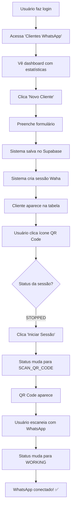

# Módulo de Gerenciamento WhatsApp com IA

Este módulo adiciona funcionalidades completas de gerenciamento multi-tenant para automações de WhatsApp com IA ao sistema EverSync.

## 📋 Funcionalidades Implementadas

### ✅ Gerenciamento de Clientes WhatsApp
- **Dashboard com estatísticas**: Total de clientes, ativos, inativos, mensagens mensais
- **Tabela completa**: Listagem com todos os dados dos clientes
- **Busca e filtros**: Pesquisa por nome, email ou WhatsApp
- **Status ativo/inativo**: Toggle direto na tabela

### ✅ Formulário de Cadastro/Edição
- Informações da empresa (nome, CNPJ, email, telefone, WhatsApp)
- Configuração do agente virtual (nome, saudação, script de atendimento)
- Planos (básico, premium, enterprise)
- Limite de mensagens mensais
- Validação completa de formulário

### ✅ Integração Waha (WhatsApp API)
- Criação automática de sessões WhatsApp
- Status em tempo real (STOPPED, STARTING, SCAN_QR_CODE, WORKING, FAILED)
- Modal QR Code para vinculação
- Auto-atualização de status a cada 5 segundos
- Gerenciamento de sessões (iniciar, parar, deletar)

### ✅ Modal QR Code
- Exibição do QR Code para escanear
- Instruções passo a passo
- Indicadores visuais de status
- Atualização automática quando conectado

### ✅ Recursos Adicionais
- **API Key automática**: Gerada automaticamente para cada cliente
- **Copiar API Key**: Botão para copiar com um clique
- **Multi-tenancy**: Isolamento completo entre tenants
- **RLS (Row Level Security)**: Políticas de segurança implementadas
- **Toast notifications**: Feedback visual para todas as ações
- **Confirmação de exclusão**: AlertDialog para confirmar antes de deletar

## 🗄️ Estrutura do Banco de Dados

### Tabela: `whatsapp_clients`

```sql
CREATE TABLE public.whatsapp_clients (
  id UUID PRIMARY KEY DEFAULT gen_random_uuid(),
  created_at TIMESTAMPTZ NOT NULL DEFAULT now(),
  updated_at TIMESTAMPTZ NOT NULL DEFAULT now(),
  tenant_id BIGINT NOT NULL REFERENCES public.tenants(id) ON DELETE CASCADE,
  
  -- Company information
  nome_empresa TEXT NOT NULL,
  cnpj TEXT,
  email TEXT NOT NULL,
  telefone TEXT,
  whatsapp_numero TEXT NOT NULL,
  
  -- Waha integration
  waha_session_id TEXT,
  waha_webhook_url TEXT,
  waha_status TEXT DEFAULT 'STOPPED',
  
  -- AI Agent configuration
  script_atendimento TEXT NOT NULL,
  nome_agente TEXT DEFAULT 'Assistente',
  saudacao_inicial TEXT DEFAULT 'Olá! Como posso ajudar?',
  
  -- API and billing
  api_key TEXT UNIQUE DEFAULT encode(gen_random_bytes(32), 'hex'),
  ativo BOOLEAN DEFAULT TRUE,
  plano TEXT DEFAULT 'basico' CHECK (plano IN ('basico', 'premium', 'enterprise')),
  limite_mensagens_mes INTEGER DEFAULT 1000,
  mensagens_usadas_mes INTEGER DEFAULT 0,
  
  UNIQUE(tenant_id, email),
  UNIQUE(tenant_id, whatsapp_numero)
);
```

**Políticas RLS:**
- Usuários só podem ver e gerenciar clientes do próprio tenant
- Apenas OWNER e ADMIN podem criar/editar/deletar clientes

## 🔧 Configuração

### 1. Variáveis de Ambiente

Crie um arquivo `.env` na raiz do projeto com as seguintes variáveis:

```env
# Supabase (já configurado)
VITE_SUPABASE_URL=https://dffhhforfwhgzdlrfzpc.supabase.co
VITE_SUPABASE_ANON_KEY=seu_anon_key

# Waha API Configuration
VITE_WAHA_URL=http://localhost:3000
VITE_WAHA_API_KEY=sua_api_key_waha

# N8N Webhook (opcional)
VITE_N8N_WEBHOOK_URL=https://seu-n8n.com/webhook/whatsapp
```

### 2. Instalação da API Waha

A Waha é uma API open-source para WhatsApp. Instale usando Docker:

```bash
docker run -it -p 3000:3000/tcp \
  -e WHATSAPP_HOOK_URL=http://your-n8n-instance/webhook \
  -e WHATSAPP_API_KEY=your-secret-key \
  devlikeapro/waha
```

**Documentação Waha:** https://waha.devlike.pro/

### 3. Configuração N8N (Opcional)

Se você quiser processar mensagens recebidas automaticamente:

1. Instale o N8N: https://n8n.io/
2. Crie um workflow com webhook
3. Configure o webhook URL nas variáveis de ambiente
4. As mensagens recebidas serão enviadas automaticamente para o N8N

## 📁 Arquivos Criados

```
src/
├── lib/
│   └── waha.ts                      # Cliente API Waha
├── hooks/
│   ├── useWhatsAppClients.tsx       # Hook para gerenciar clientes
│   └── useWaha.tsx                  # Hook para status Waha
├── components/
│   ├── WhatsAppClientForm.tsx       # Formulário cadastro/edição
│   └── WhatsAppQRModal.tsx          # Modal QR Code
├── pages/
│   └── WhatsAppClients.tsx          # Página principal
└── types/
    └── database.ts                  # Tipos TypeScript (atualizado)
```

## 🚀 Como Usar

### 1. Acessar o Módulo

Após fazer login no sistema, acesse o menu lateral e clique em **"Clientes WhatsApp"**.

### 2. Criar um Novo Cliente

1. Clique no botão **"Novo Cliente"** (azul, no topo direito)
2. Preencha o formulário:
   - **Nome da Empresa*** (obrigatório)
   - **Email*** (obrigatório, formato válido)
   - **WhatsApp Number*** (obrigatório, 12-13 dígitos no formato: 5521987654321)
   - **Script de Atendimento*** (obrigatório, mínimo 50 caracteres)
   - Campos opcionais: CNPJ, Telefone, Nome do Agente, Saudação
3. Clique em **"Salvar"**
4. O sistema criará automaticamente:
   - Registro no banco de dados
   - API Key única
   - Sessão Waha (WhatsApp)

### 3. Vincular WhatsApp

1. Na tabela de clientes, clique no ícone **QR Code** (ao lado do botão editar)
2. O modal será aberto mostrando:
   - **Status atual da conexão**
   - Se status = STOPPED: clique em **"Iniciar Sessão"**
   - Se status = SCAN_QR_CODE: **escaneie o QR Code** com o WhatsApp
   - Se status = WORKING: **WhatsApp conectado!** ✅

**Passos para escanear:**
1. Abra o WhatsApp no celular
2. Vá em **Menu → Aparelhos conectados**
3. Toque em **"Conectar um aparelho"**
4. Escaneie o código QR exibido no modal

### 4. Gerenciar Clientes

**Ativar/Desativar:**
- Use o checkbox na coluna "Status"
- Cliente inativo não receberá mensagens

**Editar:**
- Clique no ícone **lápis** (Pencil)
- Modifique os dados necessários
- Clique em "Salvar"

**Copiar API Key:**
- Clique no ícone **copiar** ao lado da API Key
- Use a chave para integrar com outros sistemas

**Deletar:**
- Clique no ícone **lixeira** (Trash)
- Confirme a exclusão no modal
- A sessão WhatsApp será encerrada automaticamente

### 5. Buscar Clientes

Use a barra de busca para filtrar por:
- Nome da empresa
- Email
- WhatsApp number

## 🎨 Design e Estilo

O módulo segue o design system do EverSync:

**Cores:**
- **Azul** (`blue-600`): Botões primários, cards de total
- **Verde** (`green-600`): Status ativos, sucessos
- **Vermelho** (`red-600`): Status inativos, erros
- **Roxo** (`purple-600`): Mensagens, plano premium
- **Amarelo** (`yellow-500`): Status "Iniciando"

**Componentes:**
- Tailwind CSS para estilização
- Shadcn/ui para componentes base
- Design responsivo (mobile-first)
- Transições suaves
- Loading states

## 🔐 Segurança

✅ **Row Level Security (RLS)** habilitado
✅ **Isolamento multi-tenant** implementado
✅ **Políticas de acesso** por role (OWNER/ADMIN)
✅ **API Keys únicas** geradas automaticamente
✅ **Validação de inputs** no formulário
✅ **Unique constraints** em email e WhatsApp por tenant

## 🔄 Fluxo Completo de Uso



## 📊 Estatísticas do Dashboard

O dashboard exibe 4 cards com métricas em tempo real:

1. **Total de Clientes** (azul): Número total de clientes cadastrados
2. **Clientes Ativos** (verde): Clientes com status ativo
3. **Clientes Inativos** (vermelho): Clientes com status inativo
4. **Mensagens no Mês** (roxo): Soma de todas as mensagens usadas

## 🐛 Troubleshooting

### Problema: QR Code não aparece
**Solução:**
- Verifique se a variável `VITE_WAHA_URL` está correta
- Confirme que o servidor Waha está rodando
- Verifique a API Key do Waha

### Problema: Erro ao criar cliente
**Solução:**
- Verifique se todos os campos obrigatórios estão preenchidos
- Confirme que o email é único no tenant
- Verifique que o WhatsApp number está no formato correto (12-13 dígitos)

### Problema: Sessão Waha fica em STARTING
**Solução:**
- Aguarde até 30 segundos
- Se não mudar, clique em "Tentar Novamente"
- Verifique os logs do servidor Waha

### Problema: WhatsApp desconecta sozinho
**Solução:**
- Isso pode acontecer se o celular ficar offline
- Reconecte escaneando o QR Code novamente
- Configure webhooks para receber notificações de desconexão

## 🔄 Próximas Melhorias (Sugeridas)

- [ ] Dashboard de analytics por cliente
- [ ] Histórico de mensagens na interface
- [ ] Templates de mensagens pré-definidos
- [ ] Agendamento de mensagens
- [ ] Relatórios de uso por cliente
- [ ] Integração com ChatGPT/Claude via edge functions
- [ ] Webhooks personalizados por cliente
- [ ] Múltiplos números WhatsApp por cliente
- [ ] Sistema de tags para organização
- [ ] Exportação de dados (CSV/Excel)

## 📚 Referências

- **Waha Documentation**: https://waha.devlike.pro/
- **Supabase RLS**: https://supabase.com/docs/guides/auth/row-level-security
- **Shadcn/ui Components**: https://ui.shadcn.com/
- **React Query**: https://tanstack.com/query/latest

## 🆘 Suporte

Se encontrar problemas ou tiver dúvidas sobre o módulo WhatsApp, verifique:
1. As variáveis de ambiente estão configuradas corretamente
2. O servidor Waha está rodando
3. As policies RLS estão habilitadas no Supabase
4. O usuário tem permissão de OWNER ou ADMIN

---

**Desenvolvido com ❤️ para EverSync - Sistema Multi-Tenant de Automação WhatsApp**
