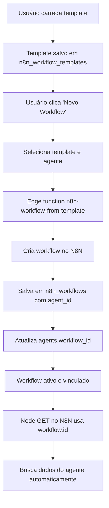

# 📚 Guia de Templates de Workflow N8N

## Como Funciona o Sistema de Templates

### 1️⃣ Carregar Template no Banco de Dados

**Onde:** Settings > Templates N8N

Os templates precisam ser carregados no banco de dados antes de poderem ser usados. Você verá dois templates disponíveis:

- 🚗 **Vendas de Carros**: Para concessionárias com consulta de estoque
- 🤝 **Atendimento Humanizado**: Atendimento completo com IA, transferências e avaliação

**Ação:** Clique em "Carregar Template" em cada card para inserir o template no banco.

---

### 2️⃣ Criar Workflow a Partir do Template

**Onde:** Integrações > Novo Workflow

Após carregar os templates, eles aparecem na lista de templates disponíveis.

**Passos:**
1. Clique em "Novo Workflow"
2. Selecione o template desejado
3. **Selecione o Agente** (obrigatório)
4. Configure os parâmetros personalizados
5. Dê um nome ao workflow
6. Clique em "Criar Workflow"

---

### 3️⃣ Vinculação Automática

Quando você cria um workflow a partir de um template:

#### ✅ O que é vinculado automaticamente:

**Na tabela `n8n_workflows`:**
- `agent_id`: ID do agente selecionado
- `client_id`: ID do cliente do agente
- `tenant_id`: ID do tenant
- `workflow_id`: ID do workflow no N8N
- `webhook_url`: URL do webhook gerado

**Na tabela `agents`:**
- `workflow_id`: ID do workflow no N8N (para queries dinâmicas)
- `n8n_workflow_id`: ID do registro na tabela `n8n_workflows`
- `webhook_url`: URL do webhook

#### 🔄 Como funciona a query dinâmica:

Os nodes Supabase GET no workflow N8N usam `$workflow.id` para buscar dados:

```sql
-- Node "Get a row (Config-IA)" no N8N
SELECT * FROM agents 
WHERE workflow_id = '$workflow.id'
```

Isso permite que:
- Cada workflow busque automaticamente as configurações do agente correto
- Atualizações no agente sejam refletidas no workflow em tempo real
- Múltiplos workflows possam usar o mesmo agente

---

### 4️⃣ Campos Dinâmicos nos Templates

#### Template "Atendimento Humanizado"

**Campos configuráveis:**
- `script_atendimento`: Script que a IA seguirá
- `saudacao`: Mensagem inicial enviada ao cliente
- `codigo_pausar_ia`: Código para pausar o bot (padrão: `PAUSAR_ATENDIMENTO`)
- `codigo_transferir_vendedor`: Transferir para humano (padrão: `TRANSFERIR_VENDEDOR`)
- `codigo_transferir_grupo`: Transferir para grupo (padrão: `TRANSFERIR_GRUPO`)
- `codigo_avaliacao`: Iniciar avaliação (padrão: `AVALIACAO`)

**Como são usados:**

```javascript
// No node AI Agent do N8N
systemMessage = `
## Nome do agente:
Olá! Sou {{ $('Config-IA').item.json.nome_agente }}

#Saudacao
{{ $('Config-IA').item.json.Saudacao }}

### CODIGOS DE ATENDIMENTOS:
Transferir grupo: {{ $('Config-IA').item.json['Transferir Grupo'] }}
Transferir vendedor: {{ $('Config-IA').item.json['Transferir Vendedor'] }}
Avaliacao: {{ $('Config-IA').item.json['Avaliação'] }}

{{ $('Config-IA').item.json.Script }}
`
```

Esses campos são substituídos durante a criação do workflow se você fornecer valores customizados. Caso contrário, o workflow usa os valores armazenados no banco de dados na tabela `agents`.

---

### 5️⃣ Fluxo Completo de Dados



---

### 6️⃣ Verificando a Vinculação

#### No Banco de Dados

**Tabela `agents`:**
```sql
SELECT 
  id,
  nome_agente,
  workflow_id,        -- ID do workflow no N8N
  n8n_workflow_id,    -- ID do registro em n8n_workflows
  webhook_url,        -- URL para receber mensagens
  client_id           -- Cliente vinculado
FROM agents 
WHERE workflow_id IS NOT NULL;
```

**Tabela `n8n_workflows`:**
```sql
SELECT 
  id,
  workflow_name,
  workflow_id,        -- ID no N8N
  agent_id,           -- Agente vinculado
  tenant_id,          -- Tenant vinculado
  webhook_url,
  is_active
FROM n8n_workflows;
```

#### No N8N Editor

1. Abra o workflow no N8N
2. Clique no node "Get a row (Config-IA)"
3. Verifique que o filtro usa: `workflow_id = {{ $workflow.id }}`
4. Execute o node manualmente para testar

---

### 7️⃣ Troubleshooting

#### ❌ Template não aparece na lista

**Solução:** Vá em Settings > Templates N8N e carregue o template.

#### ❌ Workflow não encontra dados do agente

**Verificar:**
1. `agents.workflow_id` está preenchido?
2. O node GET usa `$workflow.id` como filtro?
3. O agente está ativo?

**Query de diagnóstico:**
```sql
-- Verificar vinculação
SELECT 
  a.nome_agente,
  a.workflow_id as n8n_workflow_id,
  w.workflow_name,
  w.is_active
FROM agents a
LEFT JOIN n8n_workflows w ON w.agent_id = a.id
WHERE a.id = 'SEU_AGENT_ID';
```

#### ❌ Códigos de atendimento não funcionam

**Verificar:**
1. Os códigos configurados no template correspondem aos do Switch node?
2. O AI Agent está usando os códigos corretos no system message?
3. O cliente está enviando exatamente o código esperado?

**Teste:**
Envie uma mensagem com o código exato (ex: `PAUSAR_ATENDIMENTO`) e veja nos logs do N8N qual node foi ativado.

---

### 8️⃣ Adicionando Novos Templates

Para adicionar um novo template:

1. **Criar arquivo JSON**: `src/assets/n8n-templates/Seu_Template.json`
2. **Criar README**: `src/assets/n8n-templates/seu-template-README.md`
3. **Criar helper**: `src/lib/load-seu-template-helper.ts`
4. **Criar edge function**: `supabase/functions/load-seu-template/index.ts`
5. **Atualizar configuração**: `supabase/config.toml`
6. **Adicionar botão em Settings**: `src/pages/Settings.tsx`
7. **Atualizar customização**: `supabase/functions/n8n-workflow-from-template/index.ts`

---

## 📞 Suporte

- **Logs**: Verifique os logs das edge functions no Supabase Dashboard
- **N8N**: Use o editor do N8N para debug de workflows
- **Database**: Use SQL queries para verificar vinculações
- **Console**: Verifique console.log no navegador durante a criação

---

## ✅ Checklist de Criação de Workflow

- [ ] Template carregado no banco (Settings > Templates N8N)
- [ ] Agente criado e ativo (Agents > Novo Agente)
- [ ] Cliente vinculado ao agente (WhatsApp > Clientes)
- [ ] Workflow criado a partir do template (Integrações > Novo Workflow)
- [ ] Agente selecionado durante criação
- [ ] Campos customizados preenchidos (opcional)
- [ ] Workflow aparece como ativo em Integrações
- [ ] `agents.workflow_id` preenchido (verificar no banco)
- [ ] Webhook URL gerado e funcionando
- [ ] Teste enviando mensagem via WAHA

---

**Última atualização:** 2025-11-08
