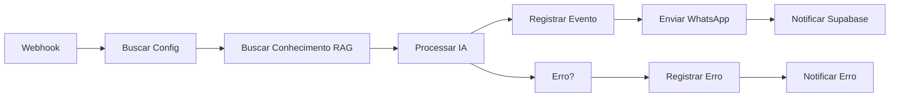

# Template N8N: Atendimento IA Completo 🤖

## 📋 Visão Geral

Template completo de atendimento automatizado com IA que integra WhatsApp, base de conhecimento (RAG), e registro de eventos no Supabase. Ideal para agentes de atendimento, vendas e suporte.

## ✨ Funcionalidades

- ✅ **Webhook Trigger**: Recebe mensagens do WhatsApp via webhook
- 🔍 **Busca de Configuração**: Carrega configurações do agente dinamicamente do Supabase
- 📚 **RAG (Retrieval Augmented Generation)**: Busca conhecimento relevante na base de dados
- 🤖 **Processamento IA**: Usa OpenAI/Claude com configurações personalizadas
- 📊 **Logging Automático**: Registra todos os eventos em `agent_events`
- 💬 **Envio WhatsApp**: Responde automaticamente via WAHA
- 🔔 **Notificações**: Envia callbacks de sucesso/erro para Supabase
- ⚠️ **Tratamento de Erros**: Captura e registra erros automaticamente

## 🎯 Fluxo de Execução



## 🔧 Configuração

### 1. Credenciais Necessárias

No N8N, configure as seguintes credenciais:

- **Supabase API** (id: 1)
  - URL: `https://dffhhforfwhgzdlrfzpc.supabase.co`
  - API Key: Sua Service Role Key

- **OpenAI API** (id: 2)
  - API Key: Sua chave OpenAI

### 2. Variáveis de Ambiente

O workflow usa as seguintes variáveis:

- `{{agent_id}}` - ID do agente (substituído automaticamente)
- `{{agent_name}}` - Nome do agente
- `$env.SUPABASE_URL` - URL do Supabase (configurado no N8N)

### 3. Webhook Configuration

O workflow cria um webhook em:
```
POST https://seu-n8n.com/webhook/agent-{{agent_id}}
```

**Payload esperado:**
```json
{
  "message": "Mensagem do usuário",
  "from": "5511999999999@c.us",
  "session": "nome-da-sessao"
}
```

## 📊 Estrutura de Dados

### Event Log (agent_events)

Cada execução registra um evento:

```typescript
{
  agent_id: string,
  event_type: "message_sent" | "error",
  severity: "info" | "error",
  event_data: {
    input: string,
    output: string,
    from: string
  },
  tokens_used: number,
  custo_brl: number,
  latencia_ms: number,
  error_message?: string
}
```

### Execution Callback (n8n_executions)

```typescript
{
  workflow_id: string,
  execution_id: string,
  status: "success" | "error",
  agent_id: string,
  tokens_used: number,
  custo_brl: number,
  input_data: object,
  output_data: object
}
```

## 🎨 Personalização

### Alterar Modelo de IA

O modelo é carregado dinamicamente de `agents_v2.modelo_ia`:
- gpt-4o-mini (padrão)
- gpt-4o
- claude-sonnet-4
- claude-opus-4

### Ajustar RAG

Modifique o node "Buscar Conhecimento (RAG)" para:
- Aumentar/diminuir o `LIMIT` de documentos retornados
- Adicionar filtros por metadata
- Ajustar a query de similaridade

### Customizar Custo

O cálculo de custo está em:
```javascript
$json.usage.total_tokens * 0.0001 * 5.80
```

Onde:
- `0.0001` = custo por token em USD
- `5.80` = cotação USD/BRL

## 📈 Monitoramento

### Dashboard de Monitoramento

Acesse `/agents/:agentId/monitoring` para ver:
- Health Score (0-100)
- Mensagens enviadas (24h)
- Taxa de sucesso
- Tokens consumidos
- Custo acumulado
- Latência média
- Logs de eventos em tempo real

### Métricas Calculadas

- **Health Score**: Baseado em taxa de sucesso, erros recentes e latência
- **Success Rate**: % de mensagens enviadas sem erro
- **Avg Latency**: Tempo médio de resposta da IA

## 🚨 Tratamento de Erros

O workflow captura automaticamente:

1. **Erros de IA**: Timeout, rate limit, etc.
2. **Erros de RAG**: Falha na busca de documentos
3. **Erros de WhatsApp**: Falha no envio

Todos os erros são:
- Registrados em `agent_events` com `severity: "error"`
- Enviados para Supabase via callback
- Disponíveis no dashboard de monitoramento

## 🔄 Integração com Sistema

### Webhook Handler

O template usa o edge function `n8n-webhook-handler` que:
1. Recebe callbacks de sucesso/erro
2. Registra em `n8n_executions`
3. Atualiza métricas do agente
4. Calcula health score

### Atualização Automática

O sistema atualiza automaticamente:
- `msgs_usadas_mes`
- `tokens_usados_mes`
- `custo_acumulado_mes`
- `ultima_conversa_em`
- `taxa_sucesso`

## 🧪 Testando o Template

1. **Teste Manual no N8N**:
   - Execute o workflow manualmente
   - Use o webhook test URL
   - Verifique os logs

2. **Teste via API**:
```bash
curl -X POST https://seu-n8n.com/webhook/agent-UUID \
  -H "Content-Type: application/json" \
  -d '{
    "message": "Olá, preciso de ajuda",
    "from": "5511999999999@c.us",
    "session": "test-session"
  }'
```

3. **Verificar Logs**:
   - Acesse o dashboard de monitoramento
   - Verifique `agent_events` no Supabase
   - Veja execuções em `n8n_executions`

## 📚 Recursos Adicionais

- [Documentação N8N](https://docs.n8n.io)
- [OpenAI API Docs](https://platform.openai.com/docs)
- [WAHA Docs](https://waha.devlike.pro)
- [Supabase Docs](https://supabase.com/docs)

## 🐛 Troubleshooting

### Problema: Workflow não executa
- ✅ Verifique se o webhook está ativo
- ✅ Confirme que as credenciais estão configuradas
- ✅ Veja os logs de execução no N8N

### Problema: IA não responde
- ✅ Verifique a API key do OpenAI
- ✅ Confirme que há créditos disponíveis
- ✅ Veja o modelo configurado em `agents_v2`

### Problema: RAG não encontra documentos
- ✅ Confirme que há documentos em `documents`
- ✅ Verifique o `agent_id` correto
- ✅ Confira se embeddings foram gerados

## 🎓 Exemplo de Uso

```javascript
// 1. Usuário envia mensagem
"Qual o horário de funcionamento?"

// 2. Sistema busca na base de conhecimento
SELECT content FROM documents 
WHERE agent_id = 'xxx' 
ORDER BY embedding <-> query_embedding 
LIMIT 3

// 3. IA processa com contexto
{
  role: "system",
  content: "Você é assistente. Contexto: [docs]"
},
{
  role: "user",  
  content: "Qual o horário de funcionamento?"
}

// 4. Resposta enviada
"Nosso horário é de segunda a sexta, das 9h às 18h."

// 5. Logs registrados
agent_events: { 
  event_type: "message_sent",
  tokens_used: 150,
  custo_brl: 0.087,
  latencia_ms: 1250
}
```

---

**Versão**: 1.0  
**Última Atualização**: 2025-01-08  
**Compatibilidade**: N8N >= 1.0, Supabase Edge Functions
